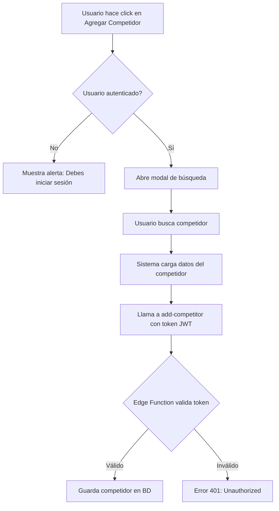

# Solución: Error 401 al Agregar Competidores

## 🔍 Diagnóstico del Problema

### Error Original
```
POST https://ibhxfrmaluxegibwqfiv.supabase.co/functions/v1/add-competitor 401 (Unauthorized)
```

### Causa Raíz
Las edge functions de competidores (`add-competitor`, `list-competitors`, `remove-competitor`) **requieren autenticación** para:
1. Verificar que el usuario es dueño del negocio
2. Prevenir que usuarios no autenticados modifiquen datos
3. Asociar correctamente los competidores con el negocio del usuario

**El problema**: El usuario no está autenticado con Google OAuth en el frontend.

## ✅ Solución Implementada

### 1. Mejores Logs en Edge Functions
Agregué logs diagnósticos para identificar el problema:
```typescript
console.log('🔑 Attempting to authenticate with token:', token.substring(0, 20) + '...');
console.error('❌ Authentication failed:', userError);
console.log('✅ User authenticated:', user.id);
```

### 2. Validación de Autenticación en Frontend
Antes de permitir agregar competidores, verifico que el usuario esté autenticado:

```typescript
const { user, session } = useAuth();

const openAddModal = () => {
  if (!user || !session) {
    alert('Debes iniciar sesión para agregar competidores');
    return;
  }
  // ... resto del código
};
```

### 3. Mensaje Visual de Advertencia
Si el usuario NO está autenticado, muestra un banner de advertencia:

```tsx
{!user && (
  <div className="mb-4 p-4 bg-yellow-50 border border-yellow-200 rounded-lg">
    <AlertTriangle />
    <p>Inicia sesión para gestionar competidores</p>
  </div>
)}
```

## 📋 Cómo Usar

### Opción 1: Autenticarse con Google (Recomendado)
1. Ve a la página principal
2. Haz click en "Iniciar sesión con Google"
3. Autoriza la aplicación
4. Ahora podrás agregar competidores

### Opción 2: Desarrollo sin Auth (Temporal)
Si estás en desarrollo y necesitas probar sin autenticación, puedes:

1. Modificar temporalmente las edge functions para aceptar una API key de desarrollo
2. O usar el service role key (⚠️ SOLO EN DESARROLLO, NUNCA EN PRODUCCIÓN)

## 🔐 Flujo de Autenticación



## 🧪 Testing

Para probar que funciona correctamente:

1. **Sin autenticación**: Deberías ver el banner amarillo de advertencia
2. **Con autenticación**: 
   - Inicia sesión con Google
   - El banner desaparece
   - Puedes agregar competidores sin error 401

## 🔧 Funciones Desplegadas

```bash
✅ add-competitor (v2) - Logs mejorados
✅ list-competitors (v1) - Activa
✅ remove-competitor (v1) - Activa
```

## 📊 Estado de Autenticación

Puedes verificar el estado de autenticación en:
- **Frontend**: Chrome DevTools > Application > Storage > Session Storage
- **Logs**: Buscar "Auth state changed" en la consola
- **Supabase Dashboard**: Project > Authentication > Users

## 🚨 Troubleshooting

### Si sigue dando 401 después de autenticarte:

1. **Verifica que la sesión esté activa**:
   ```javascript
   // En la consola del navegador
   const { data: { session } } = await supabase.auth.getSession()
   console.log('Session:', session)
   ```

2. **Verifica que el token se esté enviando**:
   - Abre Chrome DevTools > Network
   - Filtra por "add-competitor"
   - Revisa los headers de la petición
   - Debe incluir: `Authorization: Bearer eyJ...`

3. **Refresca el token**:
   ```javascript
   await supabase.auth.refreshSession()
   ```

4. **Cierra sesión e inicia nuevamente**:
   - Puede que el token haya expirado
   - Sign out → Sign in con Google

## 📝 Próximos Pasos

- [ ] Agregar refresh automático de token
- [ ] Mejorar mensajes de error específicos
- [ ] Agregar retry automático en caso de token expirado
- [ ] Implementar modo offline con sincronización posterior

